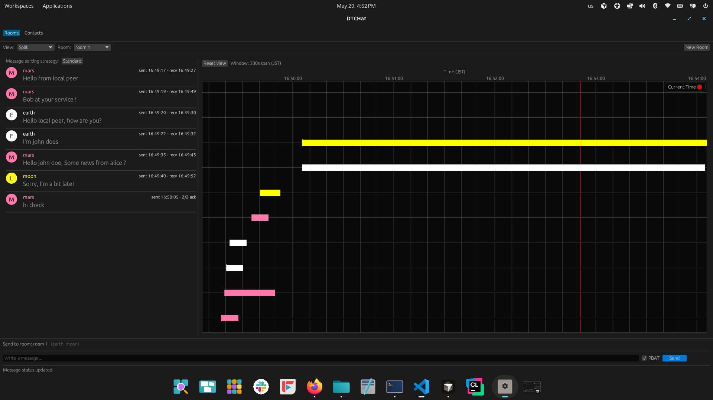

# DTChat — 3-Node DTN Interop Demo

DTChat is a GUI chat app for Delay Tolerant Networks (Bundle Protocol). This
repo is set up for a 3-node full-mesh demo: **Earth** and **Mars** run ION-DTN
(reached via bp-socket / `AF_BP`), **Moon** runs µD3TN (reached via a local AAP2
bridge). Each node runs the same DTChat binary with a different config and talks
only to its local DTN stack; the stacks route between planets over the network.



## Topology

| Node  | Node ID | IP          | Stack   | DTChat endpoint | Transport            |
|-------|---------|-------------|---------|-----------------|----------------------|
| earth | ipn:10  | 192.168.1.1 | ION-DTN | ipn:10.2        | bp-socket (AF_BP)    |
| moon  | ipn:20  | 192.168.1.2 | µD3TN   | ipn:20.2        | TCP → AAP2 bridge    |
| mars  | ipn:30  | 192.168.2.2 | ION-DTN | ipn:30.2        | bp-socket (AF_BP)    |

One-way delays: earth↔moon ≈ 1 s, earth↔mars ≈ 240 s. Earth relays moon↔mars
(mars has no direct contact with moon), so moon→mars ≈ 241 s. These values live
in the ION `ipn.rc` (routing) and `db/contact_plan.rc` (DTChat's PBAT bars).

## Prerequisites

- **Rust** (all nodes): https://rustup.rs/ , plus `protobuf`.
- **Earth / Mars** (ION): ION-DTN installed, plus `linux-headers-$(uname -r)` and
  `build-essential` so the bp-socket kernel module builds.
- **Moon** (µD3TN): a running µD3TN and `python-ud3tn-utils` on `PYTHONPATH`.

On a fresh Debian/Ubuntu/Pop!_OS machine, `scripts/setup/bootstrap.sh` installs all
of the above (build + GUI libs, Rust, kernel headers, and the role's DTN stack):

```bash
sudo ROLE=ion   ./scripts/setup/bootstrap.sh   # Earth / Mars
sudo ROLE=ud3tn ./scripts/setup/bootstrap.sh   # Moon (builds uD3TN + AAP2 utils)
```

## Clone

```bash
git clone https://github.com/space-wg/DTChat.git
cd DTChat
cargo build --release
```

## Run the demo

### Earth / Mars (ION)

`start_ion.sh` starts ION, builds + inserts `bp.ko` (idempotent), and runs the
bp-socket daemon. `bp-socket` is vendored in this repo, so the default path works.

```bash
sudo NODE=earth ./scripts/ion/start_ion.sh        # use NODE=mars on Mars
# in a second terminal on the same node:
DTCHAT_CONFIG=db/earth.yaml cargo run --release    # db/mars.yaml on Mars
```

Override the bp-socket location with `BP_SOCKET_DIR=/path/to/bp-socket` and ION's
lib dir with `ION_LIB=/usr/local/lib` if needed.

### Moon (µD3TN)

Start µD3TN (see `db/moon.yaml` header for the exact `ud3tn` line), then the
bridge and DTChat:

```bash
export UD3TN_BDM_SECRET=<your 16+ char secret>
python3 scripts/aap2_bridge/aap2_bridge.py \
    --aap2-socket ud3tn.aap2.socket --agentid 2 \
    --recv-forward 127.0.0.1:7720 \
    --route 7710=ipn:10.2 --route 7730=ipn:30.2 &
DTCHAT_CONFIG=db/moon.yaml cargo run --release
```

## Interop bring-up (6-node: gateways + leaves)

The live interop runs three **gateways** (earth/mars ION, lunar µD3TN) plus three
**leaf** nodes that run DTChat (`space2`=earth leaf `ipn:11`, `space1`=moon leaf
`ipn:21`, `space3`=mars leaf `ipn:31`). Commands below use the SSH aliases in
`~/.ssh/config`; start the pieces in this order.

### 1. Earth & Mars gateways (ION)

```bash
ssh earth 'export LD_LIBRARY_PATH=/usr/local/lib; cd /home/spacewg/rcfiles && ionstart -I host10.rc'
ssh mars  'export LD_LIBRARY_PATH=/usr/local/lib; cd /home/spacewg/rcfiles && ionstart -I host30.rc'
```

If `ionstart` hangs at `[1/4]` (stale shared memory), restart clean:
`ionstop; killm; ionstart -I host10.rc`. Verify the 240 s Earth↔Mars delay loaded
with `(echo "l range"; sleep 1) | ionadmin | grep "node 10 to node 30"`.

### 2. Lunar gateway (µD3TN `ipn:20`)

Starts the node, then configures contacts/routes. **The route list must include
every leaf EID**, or leaf-addressed bundles are dropped at the gateway (the link
is up but µD3TN has no route, so the receiver never sees the message).

```bash
ssh lunar
cd /home/spacewg/interop2026/ud3tn
source .venv/bin/activate
export UD3TN_BDM_SECRET="interop2026spacewg"

# node
build/posix/ud3tn --node-id ipn:20.0 \
    -s ud3tn.socket -S ud3tn.aap2.socket \
    --cla "tcpclv3:*,4556" -x UD3TN_BDM_SECRET &

# toward earth: reach earth gw + both leaves + mars gw through ipn:10
aap2-config --socket ud3tn.aap2.socket --secret-var UD3TN_BDM_SECRET \
    --schedule 1 86400 100000 \
    -r ipn:10.0 -r ipn:11.0 -r ipn:30.0 -r ipn:31.0 \
    ipn:10.0 tcpclv3:192.168.1.1:4556

# toward the moon leaf (return path for earth/mars -> space1)
aap2-config --socket ud3tn.aap2.socket --secret-var UD3TN_BDM_SECRET \
    --schedule 1 86400 100000 \
    -r ipn:21.0 \
    ipn:21.0 tcpclv3:192.168.20.2:4556
```

> µD3TN contacts are **runtime only** — re-run both `aap2-config` calls every time
> the node restarts, otherwise the mesh silently loses the leaf routes.

### 3. Moon leaf (µD3TN `ipn:21` + AAP2 bridge) on space1

```bash
ssh space1 'cd ~/DTChat && setsid bash scripts/ud3tn/start_moon_leaf.sh >/tmp/moon_leaf.log 2>&1 </dev/null'
ssh space1 'tail -5 /tmp/moon_leaf.log'   # expect "TCPCLv3 ... Connected ... ipn:20.0"
```

### 4. Earth & Mars leaves (ION + bp-socket) on space2 / space3

```bash
ssh space2 'cd ~/DTChat && sudo NODE=earth ./scripts/ion/start_ion.sh'
ssh space3 'cd ~/DTChat && sudo NODE=mars  ./scripts/ion/start_ion.sh'
```

### 5. Launch DTChat on each leaf

```bash
ssh space1 'cd ~/DTChat && DTCHAT_CONFIG=db/moon.yaml  ./target/release/DTChat'
ssh space2 'cd ~/DTChat && DTCHAT_CONFIG=db/earth.yaml ./target/release/DTChat'
ssh space3 'cd ~/DTChat && DTCHAT_CONFIG=db/mars.yaml  ./target/release/DTChat'
```

Quick connectivity check: established TCPCL on `:4556` between lunar↔earth and
space1↔lunar (`ss -tn | grep 4556`), and `udplso`/`ltpclock` running on earth/mars
for the LTP legs. Test Moon↔Earth first (≈1 s), then Earth↔Mars (≈240 s each way).

## Local testing (no DTN stack)

Three loopback configs simulate the mesh over UDP on one machine:

```bash
DTCHAT_CONFIG=db/default.yaml cargo run   # earth (10)
DTCHAT_CONFIG=db/local2.yaml  cargo run   # moon  (20)
DTCHAT_CONFIG=db/local3.yaml  cargo run   # mars  (30)
```

This exercises fan-out, PBAT bars, and ACKs. Real per-hop delays only appear once
connected to the actual DTN stacks.

```bash
cargo test                                   # app + mesh integration tests
python3 scripts/aap2_bridge/test_aap2_bridge.py   # bridge relay tests
```

## What to edit for a different network

| Change            | Edit                                                        |
|-------------------|-------------------------------------------------------------|
| Ethernet IPs      | `scripts/ion/*.ipn.rc` (induct/outduct/plan), µD3TN contacts |
| EIDs              | `scripts/ion/*.ipn.rc` **and** `db/*.yaml`                  |
| Delays / topology | `scripts/ion/*.ipn.rc` (range) **and** `db/contact_plan.rc` |

## Layout

```
db/                 per-node configs + contact plan
scripts/ion/        ION ipn.rc files + start_ion.sh
scripts/aap2_bridge/ µD3TN AAP2 bridge + tests
bp-socket/          vendored AF_BP kernel module + daemon (ION nodes)
src/                DTChat application
```
